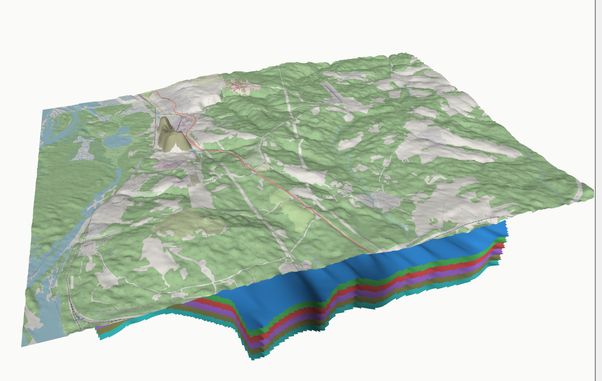

# Isoliner3D

[English](README.en.md) · **Русский**

[](https://plugins.qgis.org/plugins/isoliner3d/)
[](https://www.informpp.ru/%D0%B3%D0%BB%D0%B0%D0%B2%D0%BD%D0%B0%D1%8F-%D1%81%D1%82%D1%80%D0%B0%D0%BD%D0%B8%D1%86%D0%B0/qgis-isoliner3d)

Плагин QGIS для показа геологической модели в объёме и для подсчёта запасов
по блочной модели: поверхности из растров, водонепроницаемые тела пластов,
скважины, разрезы, наложение карт текстурой.



Рендер идёт на pyqtgraph и PyOpenGL, которые лежат внутри плагина. Штатный
3D-вид QGIS и Qt3D не используются, внешних зависимостей нет.

Плагин-спутник набора кригинга и изолиний [Isoliner](https://plugins.qgis.org/plugins/grid_isolines/) и инструмента чистки топологии [Topoliner](https://plugins.qgis.org/plugins/topoliner/). Вместе они закрывают путь от точек наблюдений до объёмной модели: Isoliner строит гриды и изолинии, Topoliner приводит в порядок контуры, Isoliner3D показывает результат в объёме и считает запасы.

## Зачем

Кровля, подошва, скважины и разрез существуют по отдельности и сходятся
только в голове у геолога. Isoliner3D собирает их в одну сцену: тела
пластов, стволы скважин насквозь, чертёж разреза на своём месте
в пространстве и карта, натянутая на рельеф.

## 3D-окно

- Поверхности из растров проекта, каждая своим цветом, с вертикальным
  преувеличением и разносом по Z.
- Тела пластов из многоканальных гридов: канал 1 кровля, канал 2 подошва,
  боковая юбка по границе фактических данных.
- Скважины стволами, интервалы окрашены по стратиграфическому положению,
  мачта с подписью над устьем, подписи прореживаются.
- Плоскость разреза со следом сечения по поверхностям и контуром сечения
  по телам.
- Полиэдры, TIN и MultiPolygon Z объёмными телами.
- Наложение карты текстурой с затенением по нормали: ортофото, тайловая
  подложка, геологическая карта со своей символикой. Разрешение задаётся
  отдельно и от плотности сетки не зависит.
- Чертёж разреза текстурой на ленте, несколько разрезов сразу.
- Опрос кликом: имя слоя, координаты, значения всех каналов, мощность.
- Куб значений показывается изоповерхностью по отсечке: замкнутое тело, годное для подсчёта объёма.
- Куб значений показывается вокселями: ячейка коробкой, цвет по интервалу содержания. Строятся только видимые грани, соседние грани одного интервала сливаются, поэтому куб в миллионы ячеек остаётся лёгким.
- Цвет берётся из оформления слоя: шкала растра, категории и градации вектора. Класс, снятый в легенде, в сцену не идёт.
- Точки показываются кругом, квадратом, ромбом, треугольником или крестом. Круг экранный и читается с любого отдаления, плоские виды лежат в плане и закрываются поверхностью.
- Точки подписываются полем слоя. Подписи с ореолом, прореживаются, их число ограничивается.
- Сцена живёт в системе координат проекта: слои в других системах перепроецируются, как на холсте карты.
- Отметка векторного слоя берётся из геометрии, из поля или с поверхности. При укладке на поверхность значение читается в каждой вершине, а там, где данных нет, объект обрезается.
- Порядок слоёв повторяет дерево карты, верхний рисуется поверх нижнего. Список следует за деревом сам.
- Куб показывается несколькими вложенными оболочками сразу: цвет каждой из шкалы, прозрачность растёт к наружным.
- Обрезка по отметке: контур и коридор режут в плане, диапазон отметок режет по вертикали.
- У каждого поля каждого инструмента своя подсказка: она говорит, чем плох другой выбор.
- Обрезка сцены контуром или линией: кусок внутри, всё кроме него, сторона от линии, коридор заданной ширины вдоль профиля. Режутся и поверхности, и векторы.
- Разметка прямо в сцене: контур и линия рисуются кликами по поверхности, сохраняются слоем проекта.
- Сцена считается по кнопке «Обновить сцену», отметки видимости только записывают, что показывать.
- Параллельная проекция и вид сверху планом.
- Снимок PNG для отчётов.

## Инструменты

Панель Processing, группа **Пласт и блочная модель**. Считают на NumPy
и GDAL, кригинг им не нужен.

| Инструмент | Что делает | Выход |
|---|---|---|
| 1.01 Собрать грид пласта | Кровля, подошва и параметры в один растр | Грид пласта |
| 1.02 Калькулятор пласта | Мощность, объём, тоннаж руды и металла, содержание | Грид и отчёт HTML |
| 1.03 Грид пласта в блочную модель | Центроид на ячейку, деление колонки по вертикали | Точки |
| 1.04 Поверхности в 3D (меши) | Экспорт гридов в формат 2DM (MDAL) | Mesh-слои |
| 1.05 Домены в канал пласта | Полигоны участков отдельным каналом грида | Грид пласта |
| 1.06 Разность запасов (списание) | Разность двух блочных моделей по ячейкам | Точки |
| 1.07 Создать пример данных (демо) | Тела с Z и проверочная карта для текстуры | Слой или растр |

Группа **Объёмная интерполяция** работает с кубом значений: канал грида
это горизонтальный уровень.

| Инструмент | Что делает | Выход |
|---|---|---|
| 2.01 Демонстрационные скважины в объёме | Пласт со складкой, линза или крутая жила, опробование интервалами | Точки |
| 2.02 Интерполяция точек в объёме | Ближний сосед и обратные расстояния с анизотропией | Куб значений |
| 2.03 Куб в блочную модель | Центроид на занятую ячейку, размер блока и объём | Точки |
| 2.04 Тело куба вокселями | Тело по отсечке коробками ячеек, объект на интервал | MULTIPOLYGON Z |

Грид пласта, собранный первым инструментом, читается 3D-окном как тело:
посчитали и сразу посмотрели. Куб, собранный вторым инструментом второй
группы, читается изоповерхностью и вокселями.

## Производительность

Прочитанные гриды и отрисованные карты кэшируются, поэтому повторная сборка
сцены идёт из памяти. На сцене из шести поверхностей и 312 тысяч
треугольников это 0.02 секунды вместо 0.77. Крупные гриды прореживаются
автоматически, форма поверхности при этом сохраняется.

Счётчики перестройки сцены видны в окне, разбивка по фазам (чтение, меши,
окраска, векторы, сборка сцены) пишется в журнал сообщений QGIS.

## Язык

Интерфейс двуязычный, русский и английский. Язык берётся из локали QGIS.
Покрытие проверяется тестом: строка без перевода не пройдёт.

## Страница для сайта

В папке `site/` лежит самодостаточная страница `isoliner3d_landing.html`:
схемы встроены в файл, переключатель языка работает без перезагрузки,
внешних запросов нет. Собирается скриптами `tools/make_figures.py`
и `tools/build_site.py`.

## Установка

Из каталога QGIS либо из ZIP: **Модули - Управление модулями - Установить
из ZIP**. Перезапуск QGIS не нужен.

Требования: QGIS 3.16 и новее, Qt5 или Qt6.

## Документация

Руководство в PDF идёт в комплекте плагина: `isoliner3d/doc/Isoliner3D.pdf`
(RU) и `Isoliner3D_en.pdf` (EN). Пункт **Модули - Isoliner3D - Справка**
открывает его на языке интерфейса.

Исходник руководства: [manual/manual.md](manual/manual.md)
и [manual/manual_en.md](manual/manual_en.md), сборка PDF
через `manual/build_pdf.sh`.

Правила работы над модулем: [AGENTS.md](AGENTS.md).
История изменений: [CHANGELOG.md](CHANGELOG.md).

## Разработка

Headless-тесты, QGIS не требуется:

```
python isoliner3d/tests/test_mesh3d.py
python isoliner3d/tests/test_polyhedral.py
python isoliner3d/tests/test_viewer3d.py
python isoliner3d/tests/test_viewer3d_static.py
python isoliner3d/tests/test_i18n.py
python isoliner3d/tests/test_algorithms_static.py
python isoliner3d/tests/test_prof.py
python isoliner3d/tests/test_cache.py
python isoliner3d/tests/test_texmesh.py
python isoliner3d/tests/test_flakes.py
```

Ядро (`mesh3d.py`, `polyhedral.py`, `demo_map.py`) это чистый NumPy без
импорта QGIS. `viewer3d.py` и `texmesh.py` импортируют Qt, QGIS
и pyqtgraph лениво, поэтому модули грузятся headless. `algorithms.py` тянет
QGIS на верхнем уровне и проверяется статически, разбором AST.

## Лицензия

GNU GPL версии 2 или новее, см. [LICENSE](LICENSE).

© 2026 ООО «Информ++» ([informpp.ru](https://www.informpp.ru/)).
