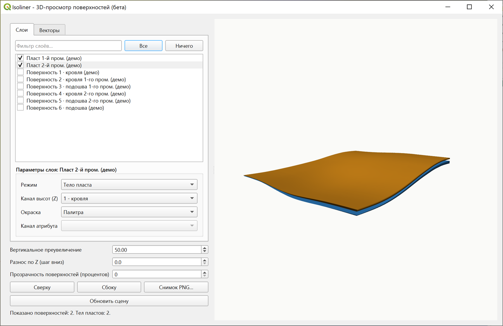
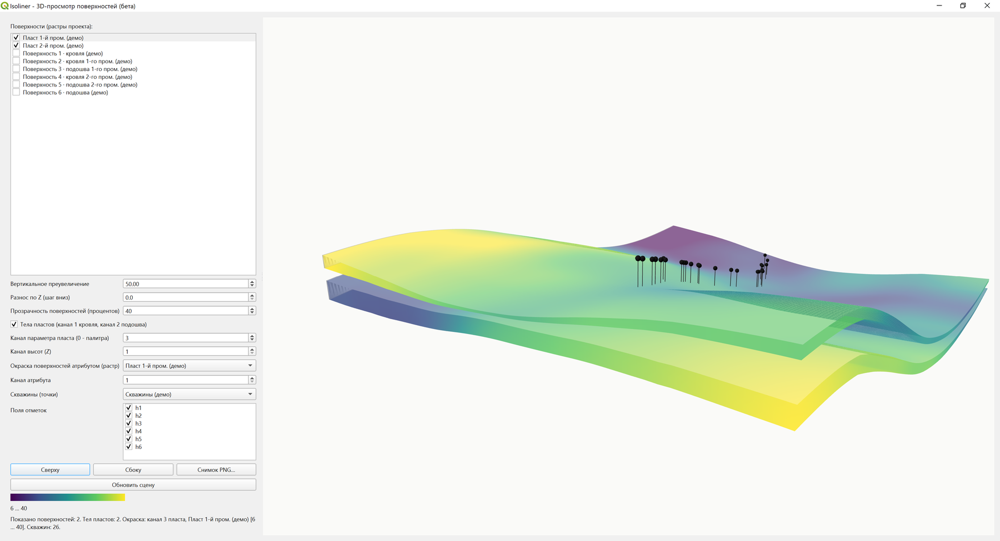

# Введение

Isoliner3D - собственное трёхмерное окно для QGIS. Оно показывает растры
проекта поверхностями, многоканальные гриды - замкнутыми телами пластов,
скважины - цветными стволами, а полигональные слои с высотой Z - объёмными
телами. Модуль не зависит от штатного 3D-вида QGIS и от Qt3D: рендер идёт
на pyqtgraph и PyOpenGL, которые вложены в плагин, устанавливать
дополнительно ничего не нужно.

Вторая часть модуля это группа инструментов **Пласт и блочная модель**
в панели Обработки: сборка грида пласта, подсчёт запасов, блочная модель,
домены, списание, экспорт в меши. Она описана в отдельной главе ниже.

Интерполяция, кригинг, изолинии, рельеф и разрезы остаются за плагином
Isoliner, спутником которого Isoliner3D является. Isoliner3D читает готовые
гриды, считает по ним объём и запасы и показывает результат в объёме.

Требования: QGIS 3.16 и новее, Qt5 или Qt6. Внешних зависимостей нет.

## Установка

**Модули - Управление и установка модулей - Установить из ZIP**, выбрать
`isoliner3d.zip`. Перезапускать QGIS не нужно.

После установки появляется панель инструментов **Isoliner3D** с одной
кнопкой и пункт **Модули - Isoliner3D - 3D-просмотр поверхностей…**
Если pyqtgraph или PyOpenGL по какой-то причине недоступны, пункт не
создаётся, а причина пишется в журнал сообщений QGIS в раздел Isoliner3D.

## Быстрый старт

1. Откройте проект, в котором уже есть растры: гриды кровли и подошвы,
   рельеф, многоканальные гриды пластов.
2. Нажмите кнопку **Isoliner3D** на панели инструментов.
3. На вкладке **Слои** отметьте нужные растры и нажмите
   **Обновить сцену**.
4. Поднимите **Вертикальное преувеличение**, пока структура не станет
   читаемой, обычно хватает 3-10 на пологих пластах.
5. Разведите поверхности параметром **Разнос по Z**, чтобы пачка
   развернулась этажеркой.
6. Сохраните кадр кнопкой **Снимок PNG…**

# Окно просмотра

Слева список слоёв, справа сцена. Сцена вращается мышью, зум колесом.
Крупные гриды прореживаются автоматически: бюджет вершин считается на всю
сцену и делится между отмеченными слоями, поэтому одиночная поверхность
получает больше деталей, чем пачка из десяти.

Список один, растры и векторы вместе, как в дереве слоёв QGIS. Тип слоя
помечен в строке, потому что от него зависит набор свойств. Первой строкой
закреплена **Сцена**: общие настройки это такой же объект списка, как слой.

Порядок списка повторяет дерево карты, сверху вниз. Из него же берётся
приоритет отрисовки: верхний слой карты рисуется поверх нижнего там, где
геометрия совпадает. Список следует за деревом сам, добавлять и переставлять
слои можно не трогая окно.

Галка включает слой в сцену и срабатывает сразу, без пересборки: элементы
уже лежат в видеопамяти. Свойства открываются двойным кликом по строке
или правой кнопкой, окно свойств не модальное и меняет содержимое при
переходе на другую строку.

Сцена считается по кнопке **Обновить сцену**, она стоит первой на панели
значков и отделена от остальных. Отметки и ползунки только записывают, что
показывать. Пока показанное отстаёт от настроек, кнопка подсвечена, а в
строке состояния написано, что нажать. Галка **Обновлять автоматически**
в свойствах сцены возвращает прежнее поведение и годится на лёгких данных.

Бюджет вершин задаётся в свойствах сцены строкой **Предел вершин в сцене
(тысяч)** и делится между слоями, которые идут телами. Если объектов слоя
не хватило на бюджет, строка состояния называет числа: сколько вершин
набрано и каков предел.

Поверх сцены слева вверху лежит панель значков: обновление сцены, вид
сверху, параллельная проекция, рисование контура, показ разметки, снятие
обрезки, сохранение контура слоем, копирование и сохранение снимка.

{width=78%}

## Система координат

Сцена живёт в системе координат проекта, как и холст карты. Слои в других
системах перепроецируются на лету, число перепроецированных печатается
в строке состояния. Отметка при этом не трогается, она и так в метрах.

Смена системы координат слоя в QGIS не двигает записанные координаты,
она меняет их толкование. Поэтому слой, которому назначили правильную
систему, встанет на место только после пересчёта сцены.

Значения растра читаются в его собственной сетке: окраска, опрос кликом
и поиск поверхности лучом переводят точку обратно. Обрезка растра тоже
считается по его сетке, контур переводится в систему слоя.

# Растровый слой: параметры

Список показывает все растры проекта. Строка **Фильтр слоёв…** сужает
список по подстроке, кнопки **Все** и **Ничего** ставят и снимают галки
у строк, видимых после фильтра. Набор сцены собирается за секунды даже
в проекте с десятками растров. Отметки переживают обновление списка,
поэтому добавление нового слоя в проект не сбрасывает уже собранную сцену.

Под списком панель **Параметры слоя** для выделенной строки. Параметры
у каждого слоя свои и запоминаются на время сеанса.

- **Режим**: Авто (многоканальный грид рисуется телом, одноканальный
  поверхностью), Поверхность (принудительно, любой канал в качестве
  высот), Тело пласта.
- **Канал высот (Z)** - выпадающий список каналов этого растра с именами
  из описаний каналов.
- **Окраска** - единый список: Палитра, Свой цвет, затем собственные
  каналы слоя по именам, затем растры проекта. При выборе внешнего растра
  оживает **Канал атрибута**, а при варианте Свой цвет - плашка справа от
  списка. Клик по плашке открывает выбор цвета, цвет хранится
  в параметрах слоя.

Текстура задаётся двумя способами. Пункт **Карта проекта (текстура)**
берёт **все видимые слои дерева** и отрисовывает их стопкой: удобно, когда
надо натянуть ровно то, что видно на карте, но лишние видимые слои попадут
на текстуру тоже. Пункты **Текстура: имя слоя** в конце списка берут ровно
один слой, и его видимость в дереве значения не имеет. Второй способ точнее
и позволяет одеть разные поверхности в разные карты.

В обоих случаях QGIS отрисовывает слои по охвату самой поверхности,
и результат ложится текстурой.
Годится что угодно, ортофото, подложка, геологическая карта со всей
символикой и подписями, отмывка рельефа. Перепроецирование берёт на себя
QGIS, поэтому система координат слоёв карты может отличаться от системы
координат грида.

Разрешение картинки задаёт **Сторона текстуры (пикселей)** под общими
настройками сцены. Оно не зависит от плотности сетки меша, поэтому
прореживание крупных гридов на детальность карты не влияет. Расплата
это видеопамять: текстура 4096 на 4096 занимает 64 МБ.

Цвет текстуры домножается на затенение по нормали поверхности. Без него
рельеф под картой перестал бы читаться, потому что пропадает светотень,
по которой глаз распознаёт форму. Сами гриды сцены в текстуру не попадают:
подкладывать поверхность саму под себя бессмысленно.

Отдельно от этого списка работает **шкала самого слоя**. Если растр
оформлен непрерывной шкалой, ступенчатой, точной или палитрой классов,
поверхность красится ровно так же, как растр на холсте: читается то же
оформление. Значения вне шкалы прижимаются к её концам, пропуски уходят
серым.

Приоритет окраски такой: текстура, затем собственный канал слоя, затем
внешний растр, затем шкала слоя, затем палитра. Выбранное руками главнее
оформления. Шкала слоя при этом главнее общей шкалы сцены: общая
растягивается сразу на все слои, и расцветка ушла бы от карты ровно там,
где её просят повторить.

Общая шкала одна на сцену, полоса с диапазоном появляется под кнопками,
ячейки без данных остаются серыми.

{width=86%}

{width=86%}

# Тела пластов

В режиме Авто многоканальный грид читается телом по конвенции: канал 1 -
кровля, канал 2 - подошва. Объём замыкается боковой юбкой по границе
данных, получается водонепроницаемое тело, которое корректно выглядит
с любой стороны и правильно режется плоскостью разреза.

Гриды пластов, собранные инструментами Isoliner, показывают в списках
каналов свои имена: кровля, подошва, дальше имена параметров. Тела
и обычные поверхности живут в одной сцене и подчиняются общим настройкам
преувеличения и прозрачности.

{width=78%}

# Векторные слои: высота, скважины, разрез

{width=86%}

Набор свойств подбирается под слой: строка, которая к нему не относится,
убирается вместе с подписью, а не гасится. У точечного слоя нет строк
призмы, у линий и полигонов нет строки типа точек, поля скважин видны
только в режиме скважин, разрез только у линейных слоёв.

## Источник высоты

**Своя высота геометрии (Z)** берёт отметку из вершин. Пункт недоступен
слою без Z.

**Отметка из поля** кладёт весь объект на одну отметку, как и положено
изолинии.

**Отметка с поверхности** снимает отметку с выбранного растра. Значение
читается в каждой вершине, поэтому объект ложится на рельеф, а не встаёт
на общую отметку. Там, где у поверхности нет данных, объект обрезается:
точка выбрасывается, ломаная рвётся на куски, а треугольник тела
с пропуском в любой вершине не строится вовсе. Ноль здесь не годится,
это отметка, а не отсутствие отметки. У самого края данных отметка
добирается ближайшей ячейкой: билинейной выборке нужны четыре соседа,
и на границе она молчит даже там, где ячейка есть.

**Плоско, на нуле** кладёт слой в нулевую плоскость.

Поверх любого источника работает **Смещение по вертикали, м**. Небольшой
подъём убирает спор за глубину, когда линия лежит ровно на поверхности,
с которой снята.

## Маркер точки и подписи

**Вид маркера** выбирается из круга, квадрата, ромба, треугольника
и креста. Круг и остальные виды устроены по-разному, и это не вкусовщина.

Круг рисуется экранным значком: размер задаётся в пикселях, при
приближении значок не растёт, читается на любом отдалении и стоит почти
ничего. Взамен он всегда рисуется поверх сцены и не закрывается
поверхностью.

Остальные виды лежат плоско в плане на отметке точки, размер задаётся
в метрах. Такой значок закрывается поверхностью и уходит под кровлю,
то есть по нему видно, где точка относительно пласта. Взамен с высоты
он сплющивается. Стоит это два-четыре треугольника на точку: слой
в восемь с половиной тысяч точек это семнадцать тысяч треугольников.

Строка размера следует за видом: у круга пиксели, у плоского значка
метры. Ноль в размере круга означает «из стиля слоя»: размер маркера
на карте задан в миллиметрах печати и пересчитывается от обычных двух.

**Поле подписи точек** задаёт, чем подписывать. Подписи прореживаются:
если рядом уже есть подписанная точка, текст не ставится. Строка
**Подписей не более** ограничивает их число, потому что каждая подпись
это отдельный элемент отрисовки. Ноль означает «без подписей».

Подписи рисуются с ореолом: текст обводится контрастным цветом, как
на топографических картах, иначе он тонет в пёстрой сцене. Размер
экранный, подпись всегда лицом к камере и стоит с отступом от точки.

## Цвет

Своего цвета у векторного слоя нет. Цвет объекта берётся из оформления
слоя: категории, градации, правила. Изолинии, раскрашенные по отметке,
приходят в сцену со своей шкалой. Класс, снятый в легенде слоя, в сцену
не попадает вовсе.

## Скважины

**Скважины (точки)** принимает точечный слой. Ниже список числовых полей,
в котором нужно отметить отметки горизонтов. Поля вида h1…h6 отмечаются
сами.

Каждая скважина рисуется стволом из цилиндрических отрезков между
соседними отметками. Интервалы окрашены по стратиграфическому положению,
то есть по порядку отмеченных полей, поэтому один и тот же горизонт по
всем скважинам идёт одним цветом. Над устьем ставится мачта с шариком:
она поднимает устье над кровлей на два процента размаха сцены, и скважина
остаётся видна даже там, где ствол уходит внутрь непрозрачного тела.
Шарики на устьях рисуются, пока скважин не больше пятисот.

**Поле подписи скважин** добавляет текст над мачтами. Поля вида name
и well угадываются автоматически, вариант **(нет)** отключает подписи.
Подписи прореживаются: если рядом уже есть подписанная скважина, текст не
ставится, и густой фонд остаётся читаемым. Потолок 500 подписей на сцену.

{width=86%}

## Плоскость разреза

**Плоскость разреза (линия)** принимает любой линейный слой. Удобнее
всего подавать слой **Определение разреза**, который создаёт инструмент
**Разрез по линии** из группы «Разрез» плагина Isoliner: лента возьмёт
диапазон высот из его полей `zmin` и `zmax`. Для произвольной линии лента
растягивается на размах сцены с запасом.

Ломаные и несколько линий в слое поддерживаются, изломы отрисовываются по
вершинам. По поверхностям вдоль ленты идёт яркий след пересечения, а по
телам с вкладки **Тела** рисуется контур сечения, то есть линия, где
вертикальная штора вдоль разреза режет тело.

{width=78%}

### Чертёж разреза на ленте

Поле **Чертёж разреза (слой или группа)** одевает ленту в настоящий
чертёж. Инструменты разреза Isoliner строят его в координатах
«расстояние вдоль линии на отметку», а лента в сцене занимает ровно ту же
область пространства, поэтому чертёж ложится на своё место без всякого
пересчёта: вдоль ленты идёт расстояние, поперёк отметка.

Выбирать можно как отдельный слой, так и группу целиком: у чертежа обычно
несколько слоёв (пласты, скважины, подписи), и группа берётся со всей
символикой в порядке дерева. Видимость слоёв роли не играет, чертёж лежит
в своих координатах и на карте всё равно мешает.

Затенение к чертежу не применяется: он должен читаться как чертёж, а не
как освещённая поверхность. Разрешение задаётся тем же полем **Сторона
текстуры**.

Несколько разрезов показываются одновременно. Инструменты Isoliner
строят чертежи по всем линиям слоя сразу и разносят их в стороны
смещением, а каждая линия определения несёт свои поля: номер разреза
`sec_id`, имя `sec`, вертикальное преувеличение `vex` и смещение раскладки
`ox`, `oy`. По ним модуль и находит на слое чертежа область своего разреза.

Охват берётся именно из полей, а не по границам объектов слоя. За рамкой
чертежа висит таблица расстояний и азимутов, и по границам объектов
картинка съехала бы. Причём заметно это стало бы не у всех, а только
у тех, кто строит с таблицей.

Имена показанных разрезов печатаются в строке состояния.

Если поля `ox` и `oy` в определении отсутствуют, чертёж не накладывается
и причина уходит в журнал: разрез построен старой версией Isoliner,
достаточно перестроить его. Если номер разреза есть, но в выбранных слоях
чертежа его нет, значит чертёж и определение из разных построений, лента
остаётся без картинки.

# Полигоны с Z: тела, контуры, призмы

Вкладка **Тела** показывает полигональные слои с высотой Z объёмными
телами прямо в сцене, рядом с поверхностями и телами пластов. Годятся
полиэдральные поверхности, TIN и любые слои MultiPolygon Z. Отметьте
нужные слои и нажмите **Обновить сцену**.

Геометрия каждого объекта разбирается на треугольники отдельным мешем
и красится своим цветом, поэтому свита из нескольких пластов выходит
разноцветной. К телам применяются те же вертикальное преувеличение
и прозрачность, что и к поверхностям, так что полиэдр и стопка горизонтов
смотрятся в одном масштабе.

Это единственный способ увидеть в объёме опрокинутую складку или козырёк:
гридом такая форма не описывается в принципе, поскольку у грида на каждый
узел приходится одна отметка, а полиэдр и TIN хранят настоящую поверхность
с несколькими значениями Z над одной точкой плана.

# Опрос сцены кликом

Клик по поверхности или телу опрашивает модель. Из камеры через курсор
пускается луч, находится ближайшее пересечение с поверхностью, и в строке
состояния печатаются имя слоя, координаты точки и значения всех каналов
по именам, а для пласта ещё и мощность. Точка попадания помечается красным
шариком. Убрать её можно тремя способами: кликом по пустому месту,
клавишей Esc вне режима рисования и кнопкой очистки на панели, которая
снимает обрезку, наброски и точку разом.

Перетаскивание от опроса отделено: вращение сцены мышью работает как
обычно, опрос срабатывает только на клик без движения.

# Обрезка сцены, разметка, виды

Сцену можно резать, оставляя только нужную часть модели. Контур обрезки
задаётся в свойствах сцены: любой полигональный или линейный слой проекта,
либо нарисованный прямо в сцене. Строка **Кусок** задаёт, что показать.

Для полигона это **Оставить внутри** или **Убрать внутри**: кусок торта
либо торт без куска. Для линии это **Слева от линии**, **Справа от линии**
и **Коридор вдоль линии**. Коридор берёт полосу заданной полуширины по обе
стороны от профиля, и это чаще всего полезнее голого разреза: рядом
с линией остаются данные, и видно, как меняется структура при отходе
от профиля. Полуширина вводится на панели над сценой, рядом с кнопками
рисования, и видна только в режиме коридора.

Край идёт по контуру, а не по прямоугольнику охвата, дырки контура
остаются дырками. Режутся не только поверхности: линии рвутся там, где
выходят за кусок, точки и скважины отбираются по своему положению, тела
по центру объекта.

**Рисование в сцене.** Значок контура включает режим разметки: клик
по поверхности ставит вершину, за курсором тянется резинка, правая кнопка
или соседний значок снимают последнюю вершину. Дальше два пути. Значок
с галкой замыкает контур и режет им площадь. Значок ломаной завершает
линию и режет коридором вдоль неё, сам включая нужный режим.

Вершины берутся с поверхности лучом из камеры, поэтому разметка ложится
по рельефу и остаётся верной при повороте сцены. Если поверхностей
из растров в сцене нет, например показаны одни изолинии, вершина берётся
с уровня середины сцены. Для обрезки используется
плановое положение вершин. Сама разметка рисуется поверх модели и не
прячется под складками.

Значок глаза прячет и показывает разметку, не снимая обрезку. Значок
с перечёркнутым контуром снимает обрезку целиком и стирает наброски.
Значок стопки листов сохраняет нарисованный контур слоем проекта, после
чего им могут пользоваться инструменты Isoliner.

**Виды.** Значок рамки с перекрестием ставит вид сверху и заодно включает
параллельную проекцию, потому что план с перспективой планом не является.
Проекция переключается и отдельно, значком куба: в параллельной проекции
масштаб одинаков по всему кадру, и объекты на разной высоте не смещаются
относительно друг друга.

**Снимок.** Значок с двумя прямоугольниками кладёт кадр сцены в буфер
обмена, то же делает Ctrl+C. Значок фотоаппарата сохраняет кадр в файл
PNG. Размер снимка равен размеру окна сцены, поэтому перед съёмкой окно
имеет смысл развернуть.

**Разнос по Z** раздвигает поверхности вниз с постоянным шагом
и превращает пачку в этажерку, где видно каждый горизонт по отдельности.
**Прозрачность поверхностей** помогает заглянуть внутрь тел и увидеть
стволы скважин сквозь кровлю.

## Обрезка по отметке

Контур и коридор режут только в плане, к высоте они отношения не имеют.
Разрез по пачке пластов задаётся отметками, и для этого на плашке
инструментов стоят два поля, **z≥** и **z≤**. Наименьшее значение
означает «без границы», это видно подписью.

Отбор идёт у тел и поясов, линий, точек, растровых поверхностей
и вокселей. Границы включаются: отметка ровно на границе остаётся, иначе
у куба пропадал бы крайний уровень. Перепутанные местами границы дают
пусто, а не меняются молча: опечатку в поле лучше увидеть сразу, чем
искать причину пустой сцены в данных.

# Группа Пласт и блочная модель

Кроме 3D-окна модуль ставит в панель **Обработка** провайдер **Isoliner3D**
с одной группой - **Пласт и блочная модель**. Семь инструментов считают
на NumPy и GDAL, кригинг и построение изолиний им не нужны, поэтому
работают они и без основного плагина Isoliner.

Конвейер выглядит так. Кровля и подошва собираются в один многоканальный
грид пласта (**1.01**), калькулятор считает по нему мощность и запасы
(**1.02**), блочная модель разворачивает грид в точки-центроиды (**1.03**),
а разность двух моделей даёт списание (**1.06**). Домены (**1.05**)
добавляют в грид код участка, экспорт в меши (**1.04**) отдаёт поверхности
в формат 2DM, генератор (**1.07**) создаёт демонстрационные тела с Z
и проверочную карту для текстуры.

Собранный грид пласта читается 3D-окном как тело: канал 1 кровля,
канал 2 подошва. То есть посчитали и сразу посмотрели.

## 1.01 Собрать грид пласта

Собирает многоканальный грид пласта по конвенции модуля: канал 1 кровля,
канал 2 подошва, каналы 3 и далее параметры (содержание, минтип, любые
другие числовые поля).

Кровля задаёт сетку результата. Подошва и параметры билинейно приводятся
к ней, поэтому исходные гриды могут иметь разный шаг и разный охват. Имена
каналов записываются в описания растра: кровля, подошва, дальше имена
слоёв параметров. Благодаря этому в списках 3D-окна вместо «канал 3»
читается «содержание».

| Параметр | Что задаёт |
|---|---|
| **Кровля (растр)** | грид кровли, задаёт сетку результата |
| **Подошва (растр)** | грид подошвы |
| **Параметры (растры, берётся канал 1)** | любое число гридов параметров, поле необязательное |
| **Канал кровли**, **Канал подошвы** | если исходные гриды многоканальные |
| **Грид пласта** | результат |

За один прогон собирается один пласт: одна кровля, одна подошва, один грид
на выходе. Для пачки из трёх пластов это три прогона либо один запуск через
кнопку **Запустить как пакетный процесс**, где каждая строка таблицы задаёт
свою пару слоёв.

**Про список параметров.** Поле необязательное. Оставьте его пустым, и
получится двухканальный грид: кровля и подошва. Для просмотра телом, для
калькулятора и для блочной модели этого уже достаточно.

Список нужен, когда к пласту есть попутные величины, привязанные к той же
площади: содержание, минеральный тип, коэффициент извлечения, любая числовая
характеристика. Отмеченные растры ложатся в грид отдельными каналами,
начиная с третьего, из каждого берётся первый канал.

Смысл в том, что после сборки пласт описывается одним файлом. Дальше по нему
работает всё остальное: калькулятор попросит указать канал содержания
и посчитает средневзвешенное содержание и тоннаж металла, блочная модель
разложит каждый канал в отдельное поле атрибутов, 3D-окно покажет каналы
в списке **Окраска** по именам. Именно поэтому имена берутся из названий
слоёв: в списках потом читается «содержание», а не «канал 3». Названия слоёв
в проекте имеет смысл привести в порядок до сборки.

Гриды параметров могут иметь свою сетку и свой охват, всё приводится
к сетке кровли билинейной выборкой. Сетку результата задаёт именно кровля,
это стоит держать в голове при выборе, что подавать первым входом.

Поля **Канал кровли** и **Канал подошвы** лежат в разделе дополнительных
и нужны только тогда, когда сами исходные гриды многоканальные. Для обычных
одноканальных там остаётся единица и трогать их не надо.

## 1.02 Калькулятор пласта

Считает по гриду пласта мощность, объём и тоннаж руды через плотность.
Если задан канал содержания, добавляются средневзвешенное по мощности
содержание и тоннаж металла.

Сводка берётся по всей площади пласта или внутри контура: полигонов
подсчётного блока или домена. Дырки в полигонах учитываются. Результат
это грид пласта с дописанными каналами мощности и запаса руды на ячейку
плюс HTML-отчёт со сводкой.

Ячейки с отрицательной мощностью, где подошва оказалась выше кровли,
обнуляются и считаются отдельно. Их количество стоит смотреть в отчёте:
это признак того, что поверхности пересекаются и модель требует правки.

| Параметр | Что задаёт |
|---|---|
| **Грид пласта** | канал 1 кровля, канал 2 подошва |
| **Канал содержания** | пусто - считать без содержания |
| **Плотность руды, т/м³** | для перевода объёма в тоннаж |
| **Контур подсчёта (полигоны)** | ограничение площади |
| **Грид пласта с мощностью и запасами** | результат |
| **Отчёт (HTML)** | сводка |

## 1.03 Грид пласта в блочную модель

Переводит грид пласта в блочную модель: точку-центроид на каждую валидную
ячейку. Атрибуты точки это строка и столбец ячейки, координаты, верх и низ,
мощность, объём, тоннаж руды и все каналы параметров под их именами
из описаний.

Дальше работает обычный векторный аппарат QGIS: фильтры выражениями,
объединение с внешними таблицами, калькулятор полей. Модель наращивается
атрибутами без пересоздания.

Параметр **Слоёв по вертикали** делит каждую колонку на N блоков между
кровлей и подошвой. У каждого блока свои отметки верха и низа, номер слоя
и доля объёма. Содержание копируется в под-блоки как есть, потому что
по вертикали оно не разбурено. Сумма запаса при делении сохраняется, это
удобная самопроверка: постройте модель с одним слоем и с пятью, суммы
тоннажа обязаны совпасть до последних знаков.

Плотность берётся из числа в параметрах или, если задан **Канал
плотности**, поячеечно из грида. Второе нужно там, где плотность руды
меняется по площади.

## 1.04 Поверхности в 3D (меши)

Экспортирует гриды поверхностей в mesh-слои формата 2DM (MDAL). Такие слои
понимают профильный инструмент QGIS, mesh-калькулятор, штатный 3D-вид
и сторонние программы.

К отметкам применяется вертикальное преобразование: отметка умножается
на масштаб и сдвигается на смещение. Масштаб даёт вертикальное
преувеличение, смещение поднимает или опускает горизонт. **Разнос по Z**
сдвигает каждый следующий грид на постоянный шаг вниз и превращает
слипшуюся стопку в читаемую этажерку. Прореживание уменьшает число узлов
на крупных гридах.

Слои загружаются в проект и получают 3D-отображение автоматически.
Ячейки без данных пропускаются.

## 1.05 Домены в канал пласта

Растеризует полигоны доменов в добавочный канал грида пласта: каждой
ячейке присваивается код домена, в который она попадает, вне доменов ноль.
Код берётся из числового поля слоя, а если поле не задано, это порядковый
номер объекта от единицы. Каналы исходного грида сохраняются, канал
`domain` дописывается последним.

Дальше домен работает как обычный параметр: калькулятор считает по контуру
домена, блочная модель фильтруется выражением по коду. Контуры доменов
должны лежать в той же системе координат, что и грид.

## 1.06 Разность запасов (списание)

Считает разность двух блочных моделей по ячейкам с совпадающими строкой
и столбцом: сколько запаса убыло между состояниями «было» и «стало».
Для каждой ячейки вычитается выбранное поле, по умолчанию тоннаж руды.
Результат это точки с полями до, после и разности. Суммарное списание
печатается в журнал.

Прямой путь оперативного списания: модель до погашения камер минус модель
после, сумма разности по контуру даёт списанный тоннаж, который идёт в акт.
Обе модели обязаны быть построены из одного грида, иначе нарезка строк
и столбцов не совпадёт.

## 1.07 Создать пример данных (демо)

Создаёт демонстрационные данные, чтобы проверить показ на своей сборке
QGIS, не трогая рабочие слои. Вариант задаётся списком **Пример**.

**Тела с высотой Z.** Тело пласта это водонепроницаемая оболочка из кровли,
подошвы и боковой юбки. Свита это стопка складчатых пластов, каждый
грузится отдельным слоем и красится своим цветом. Ещё есть куб и тетраэдр.
Плановое положение и размер берутся из охвата, по вертикали тело занимает
от отметки залегания до отметки плюс мощность.

Тип геометрии плоский, поэтому в 2D-виде высота не видна, диапазон Z
печатается в журнал. Само тело удобно смотреть на вкладке **Тела**
3D-окна. Нативный PolyhedralSurface Z доступен с QGIS 3.40, на более старых
сборках вывод деградирует до MultiPolygon Z. Флаг TIN выдаёт
триангулированную поверхность.

**Карта (растр для текстуры).** Трёхканальная картинка для проверки
наложения текстуры. Охват лучше задавать полем **Карта: по охвату грида**,
тогда карта ляжет ровно по границам поверхности.

Картинка нарочно проверочная, а не красивая. Наложение текстуры ошибается
тремя типовыми способами, и каждый эта карта показывает сразу. Переворот
по вертикали виден по разным меткам в углах, сдвиг и перекос по
координатной сетке, растяжение по одной оси по неквадратности клеток.
На красивой карте ничего этого не заметить.

Порядок проверки такой. Создайте карту по охвату своего грида, поставьте
у грида окраску **Текстура: Карта (демо)** и обновите сцену. Если метки
в углах на своих местах, а клетки сетки квадратные, наложение работает
верно.

# Подсказки к полям

У каждого поля каждого инструмента есть своя подсказка: она видна прямо
у строки ввода. Общая справка лежит сбоку и читается один раз, а решать
«что сюда писать» приходится у каждого поля. Подсказка отвечает на этот
вопрос и говорит, чем плох другой выбор. Например, у шага сетки написано,
что мельче расстояния между точками делать незачем, потому что данных
в промежутке нет, а число узлов растёт как квадрат.

## 1.08 Карта для текстуры (демо)

Рисует проверочную карту с координатной сеткой и полями пластов. Нужна,
чтобы посмотреть, как ложится текстура на поверхность в окне просмотра:
на настоящей карте перекосы и растяжения видно хуже, чем на клетках.

Охват берётся из готового грида, если он задан, иначе из поля охвата:
карта тогда ляжет ровно по границам поверхности.

Раньше карта была одним из примеров в 1.07. Там на неё работали четыре
поля из тринадцати, а остальные при её выборе не читались вовсе.

# Группа Объёмная интерполяция

Вторая группа панели Processing работает с кубом значений. Куб это
многоканальный грид, где канал это горизонтальный уровень, а отметка
первого уровня и шаг лежат в метаданных `Z0` и `DZ`.

## 2.01 Демонстрационные скважины в объёме

Данные с известной истиной внутри: содержание задано моделью, шум
добавляется отдельно. На таких точках сравнивают методы объёмной
интерполяции, потому что ошибку считают по расхождению с заложенной
моделью, а не на глаз.

**Тип залежи** задаёт геометрию тела. Пласт со складкой и падением нужен,
чтобы увидеть главное: горизонтальные уровни куба режут залежь поперёк.
Линза изотропна и проще всех, крутая жила проверяет обратный случай,
когда тело почти вертикально.

Сеть скважин идёт со сбивкой, устья по рельефу, глубины разные, часть
скважин недобурена. Правильная сетка одинаковой глубины давала бы
интерполяции слишком лёгкую задачу.

Опробование идёт интервалами. Поля: `hole` номер скважины, `from_m`
и `to_m` интервал пробы от устья вниз, `grade` содержание с шумом,
`truth` содержание по модели без шума, `zone` единица внутри тела.
Шум логнормальный, отрицательных содержаний не возникает.

Граница тела проходит там, где содержание падает до половины ядра над
фоном. Это и есть отсечка, она печатается в журнал вместе с числом проб
и диапазоном содержаний.

Площадка задаётся охватом. Пустой охват даёт километр от начала
координат, и об этом пишется в журнал.

## 2.02 Интерполяция точек в объёме

В основном списке десять строк и все они про исходные данные. Настройка
метода убрана в дополнительные: анизотропия, радиус, степень, наименьшее
число точек, сектора.

**Источник отметки** задаётся отдельно от геометрии. Плоский слой отдаёт
нулевую Z у каждой точки, и если брать её как есть, все пробы лягут
в одну плоскость. Отметка берётся из поля, когда она посчитана, либо
как глубина вниз от выбранной поверхности: последнее нужно почвенным
и подобным пробам, где записана глубина, а не отметка.

**Шаг сетки и наибольшее число точек** берутся от данных, если оставить
ноль. Шаг в плане это пятая часть расстояния между точками плана, шаг
по вертикали половина шага опробования, соседей на одного больше, чем
замеров в одной точке плана. Что подставлено, печатается в журнал.
Постоянные умолчания не подходят никому: на пробах через триста метров
шаг в двадцать пять метров мельче самих данных, а на площадке
в двадцать семь километров он даёт сорок пять миллионов узлов.

**Соседи набираются по секторам.** Окружность вокруг узла делится
на равные части, из каждой берётся своя доля ближайших точек. Без этого
при анизотропии все соседи оказываются в одной скважине: проба в стволе
в сотни раз ближе соседней скважины, и обратные расстояния вырождаются
в ближайшего соседа.

**Анизотропия** это отношение вертикального масштаба к горизонтальному.
Большая сглаживает по вертикали, малая сохраняет различие по глубине.
У скважин вертикали много и сжимать её надо, у проб по трём уровням
наоборот.

Узлы, где точек в радиусе меньше заданного минимума, остаются пропуском.

Инструмент замеряет сеть опробования и пишет её в журнал, а если сетка
выходит неподъёмной или много мельче сети, предупреждает до начала
счёта.

## 2.03 Куб в блочную модель

Точка-центроид на каждую занятую ячейку. Куб как набор каналов ничем
не адресуется: канал это номер, а не отметка, и ни фильтр выражением,
ни таблица атрибутов по нему не работают. Блочная модель возвращает
ячейке номер, координаты, размер и значение.

Поля: `bid`, `lev` уровень, `row` и `col` ячейка грида, `x`, `y`, `z`
центр блока, `dx`, `dy`, `dz` размер блока, `vol` объём, `val` значение,
`cls` номер интервала окраски, при заданной плотности ещё `dens`
и `ore_t`.

Пропуски и ячейки ниже отсечки не выгружаются, поэтому модель выходит
разреженной и весит на порядок меньше полного параллелепипеда с пустыми
краями. Контур ограничивает выгрузку подсчётным блоком.

## 2.04 Тело куба вокселями

То же, что видно в сцене вокселями, но слоем: MULTIPOLYGON Z, объект
на интервал окраски. Поля: `cls`, `vmin` и `vmax` границы интервала,
`faces` число граней, `shell` единица у тела.

Флаг **Сливать соседние грани** делает слой лёгким, но ломает
замкнутость. Для подсчёта объёма флаг снимается.

Отдельно считаются защипы по ребру. Защип это касание двух ячеек одной
диагональю: дырой он не является и объём не портит, но ребро в нём
принадлежит четырём граням, и проверка замкнутости такое тело отвергает.
Флаг **Убирать защипы по ребру** заполняет угол одной ячейкой, и касание
становится по грани. На демонстрационном пласте в семнадцать тысяч ячеек
такой защип ровно один, и лечится он добавлением двух ячеек.

## 2.05 Проверка интерполяции

Убирает каждую пробу по очереди, считает значение в её точке
по остальным и сравнивает с настоящим.

Это единственный способ узнать, можно ли верить кубу: сравнивать
построенное не с чем, а на глаз одинаково убедительно выглядят
и хорошая модель, и вымысел.

**Что исключать.** Без поля скважины убирается одна проба. На
разведочной сети это льстит модели: соседей она берёт из того же ствола
в трёх метрах, и меряется связность по стволу, а не умение попасть
между скважинами. На демонстрационных данных разница шестикратная:
ошибка по пробам 0.17, по скважинам 1.10. Задав поле скважины, убираем
ствол целиком.

Проверка по одной пробе к тому же почти не видит анизотропию: отбор
ближайших от неё не зависит, пока ближайшая точка своя же по стволу.
По такой проверке нельзя выбирать ничего, что касается плана.

Параметры задаются те же, что в 2.02. Меняя их и смотря на ошибку,
подбирают анизотропию, степень и число соседей: правильного значения
у них нет вообще, есть только лучшее на этих данных.

В журнал идут четыре числа. Средняя ошибка и среднеквадратичная
говорят о величине промаха, смещение о том, уводит ли модель в одну
сторону, а доля ошибки от размаха данных ставит её в масштаб: единица
это много на содержаниях до двух и мало на содержаниях до ста. Разброс
и односторонний увод выглядят одинаково, а лечатся по-разному, поэтому
смещение вынесено отдельно.

Поля слоя невязок: `value` настоящее значение, `model` посчитанное,
`resid` разность, `aresid` её модуль. По ним видно не только величину
промаха, но и где он случился.

Полторы тысячи проб проверяются примерно за секунду.

## 2.06 Кригинг в объёме

Считает куб значений кригингом и вторым выходом даёт куб дисперсии
оценки.

**Чем отличается от 2.02.** Обратные расстояния взвешивают по одному
расстоянию: им всё равно, на каком расстоянии связь пропадает и сколько
разброса приходится на ошибку опробования. Кригинг берёт веса
из вариограммы и знает и то, и другое. Ещё он учитывает, что соседи
знают друг про друга: две пробы рядом несут почти одно и то же,
и двойного голоса им не даётся.

**Когда это окупается.** Не всегда, и это стоит знать заранее.
На демонстрационных данных при разной густоте сети:

| скважин | шаг сети | длина связи | обратные расстояния | кригинг | |
|---|---|---|---|---|---|
| 16 | 193 м | 243 м | 1.331 | 1.454 | −9 % |
| 25 | 142 м | 285 м | 1.047 | 1.055 | −1 % |
| 49 | 109 м | 264 м | 0.936 | 0.896 | +4 % |
| 100 | 78 м | 294 м | 0.643 | 0.601 | +7 % |
| 196 | 54 м | 261 м | 0.483 | 0.446 | +8 % |

Перелом там, где шаг сети около половины длины связи. Когда скважины
стоят реже, соседние уже почти ничего не знают друг о друге, веса
выходят почти равными у любого метода, и разница уходит в шум.
Инструмент печатает шаг сети и длину связи в журнал и предупреждает,
если сеть редкая.

**Дисперсия оценки.** Второй куб даёт то, чего у обратных расстояний
нет вовсе: в самой пробе она ноль, дальше от данных растёт. Это карта
доверия, и на редкой сети она единственная причина брать кригинг.
Смотреть её удобно вокселями: сразу видно, где модель гадает.

**Вариограмма** замеряется по самим данным. Длина связи берётся
из планового замера, самородок из вертикального, анизотропия как
отношение длин. Самородок из планового замера брать нельзя: в плане пар
ближе шага сети нет вовсе, первый интервал начинается там же,
и самородок оттуда это продолжение прямой к нулю через пустоту.
По стволу пары есть с трёх метров.

**Отрицательные значения.** У кригинга веса бывают отрицательными,
и оценка может выйти за размах проб: на содержаниях это значения ниже
нуля, которых быть не может. Инструмент это замечает и говорит. Лечится
сферической моделью вместо гауссовой или поднятым самородком.

# Куб значений: изоповерхность и воксели

Многоканальный грид читается не только как пласт, но и как куб значений:
канал это горизонтальный уровень. Так выглядит результат объёмной
интерполяции, например содержания по точкам опробования.

В свойствах растрового слоя выберите режим **Изоповерхность по кубу**
и задайте **отсечку**. Внутрь тела попадает всё, что не меньше этого
значения. Отметка первого уровня и шаг по вертикали берутся из метаданных
грида, поля `Z0` и `DZ`. Если их нет, счёт идёт от нуля с единичным шагом.

Оболочка строится маршем по тетраэдрам. Тетраэдр делится однозначно,
поэтому соседние ячейки сходятся гранями и тело выходит замкнутым:
каждое ребро принадлежит ровно двум граням. Замкнутость нужна не для
красоты, по ней считается объём и по ней строится закрытый срез при
обрезке.

Пропуски в данных остаются снаружи тела: пустота не притягивает
оболочку.

Дальше такое тело живёт как обычное: режется контуром и коридором,
красится, выгружается в GLB.

## Несколько оболочек сразу

Строка **Оболочек по отсечке** задаёт, сколько оболочек строить. Одна
берётся по заданной отсечке, несколько раскладываются от неё до вершины
куба. Цвет каждой берётся из шкалы, прозрачность растёт к наружным, чтобы
внутренние читались сквозь них.

Марш идёт по пограничным ячейкам, а не по всему кубу: ячейки целиком
внутри и целиком снаружи граней не дают, а их подавляющее большинство.
Вершины склеиваются, поэтому соседние грани делят общую точку. На кубе
сто на сто на шестьдесят пять оболочек считаются около секунды и весят
одиннадцать мегабайт.

## Воксели

Второй способ показать куб это режим **Воксели по кубу**. Ячейка
рисуется коробкой: шаг грида по горизонтали, шаг уровней по вертикали,
то есть ровно тот объём, который она и означает в подсчёте. Цвет берётся
по интервалу содержания, число интервалов задаётся строкой **Интервалов
окраски**.

Считать надо не ячейки, а грани. Грань между двумя занятыми соседями
не видна никогда, поэтому её отбрасывают: у заполненного куба двести
на двести на сто это сто двадцать шесть тысяч граней вместо двадцати
четырёх миллионов. Соседние грани одного интервала сливаются
в прямоугольник, и демонстрационный пласт на четырёх миллионах ячеек
даёт тридцать четыре тысячи прямоугольников и две с половиной мегабайты
сцены.

Цену задаёт площадь поверхности, а не число ячеек. Компактная залежь
дешёвая, рассыпанная по отсечке даёт миллионы граней и в сцену не идёт:
размер оценивается до сборки, и выше предела в журнал уходит число
и совет поднять отсечку или уменьшить число интервалов.

Слияние стоит замкнутости: длинный прямоугольник упирается в два
коротких, общего ребра у них нет. Для показа это не важно, для подсчёта
объёма слияние выключается галкой **Сливать соседние грани**, и тогда
каждое ребро принадлежит ровно двум граням.

Обрезка вокселей это отбор ячеек, поэтому крышку строить не надо и срез
выходит плоским сам по себе.

# Выгрузка сцены

Значок с кубом и стрелкой на панели над сценой записывает показанное
в файл GLB. Формат открывают браузерные просмотрщики, Blender и Windows,
поэтому модель можно отправить письмом одним файлом.

Выгружается ровно то, что видно, включая обрезку, с цветами в вершинах.
Текстура пока не выгружается, поверхность с картой уходит ровным цветом.

При выгрузке задаётся вопрос о вертикальном преувеличении. Настоящие
высоты верны для расчёта и стыковки с другими данными, модель как
на экране нужна для показа: пласт в километры по площади и десятки
метров по мощности иначе сплющивается в блин.

# Соседние плагины

Isoliner3D работает не сам по себе. Три плагина закрывают путь от точек
наблюдений до объёмной модели, и каждый делает свою часть.

**Isoliner** строит гриды и изолинии: кригинг с вариограммами, минимальная
кривизна, рельеф и водосборы, разрезы с чертежами, геологическая модель
пласта. Именно он готовит те гриды и пояса, которые здесь показываются.
Каталог: `plugins.qgis.org/plugins/grid_isolines`.

**Topoliner** приводит в порядок контуры: висячие узлы, самопересечения,
щели и нахлёсты между смежными полигонами, прореживание с сохранением
топологии. Полезен перед сборкой поясов и тел, потому что рваная топология
на карте превращается в рваную оболочку в объёме.
Каталог: `plugins.qgis.org/plugins/topoliner`.

**Isoliner3D** показывает результат в объёме, режет модель контуром
и коридором, считает запасы по блочной модели и выгружает сцену в GLB.

Все три работают независимо: ставить весь набор не обязательно.

# Типичные ситуации и решения

| Что видно | Причина | Решение |
|---|---|---|
| Пункта меню и кнопки нет | pyqtgraph или PyOpenGL недоступны, `is_available()` вернул ложь. | Посмотреть журнал QGIS, раздел Isoliner3D. Обычно означает повреждённую установку: переустановить модуль из ZIP целиком, вместе с папкой `libs`. |
| Сцена пуста, в строке состояния просьба отметить растр | Не отмечено ни одного слоя. | Поставить галки на вкладке **Слои** или **Тела** и нажать **Обновить сцену**. |
| Сообщение «Гриды не открылись» | Файлы отмеченных растров недоступны: переехали, лежат на отключённом диске, слой был временным. | Проверить источник слоя в свойствах, при необходимости пересоздать грид. |
| Поверхность выглядит плоским блином | Реальный размах высот мал по сравнению с размерами площади. | Поднять **Вертикальное преувеличение**. |
| Пласт нарисован поверхностью, а не телом | Грид одноканальный либо в **Режиме** стоит Поверхность. | Проверить число каналов и поставить Авто или Тело пласта. |
| Тело вывернуто, кровля ниже подошвы | Каналы перепутаны, конвенция требует канал 1 кровля, канал 2 подошва. | Пересобрать грид пласта в правильном порядке каналов. |
| Скважины не видны | Не отмечены поля отметок, либо все отметки пустые. | Отметить числовые поля отметок в списке на вкладке **Векторы**. |
| Подписей меньше, чем скважин | Работает прореживание, потолок 500 подписей. | Так и задумано. Приблизить камеру или подать слой с прореженным фондом. |
| Поверхность выглядит грубее исходного грида | Сработало автопрореживание до 60 тысяч узлов. | Так и задумано. Для детали по фрагменту вырезать нужный кусок грида и подать его отдельным слоем. |
| Лента разреза уходит далеко за пачку | Линия подана без полей `zmin` и `zmax`, лента растянута на размах сцены. | Подать слой определения разреза из Isoliner. |
| Слой уехал в сторону от остальных | Система координат слоя не та, что записана. | Назначить слою верную систему и нажать **Обновить сцену**: в строке состояния появится число перепроецированных слоёв. |
| Правка свойств ничего не меняет | Сцена считается по кнопке. | Нажать **Обновить сцену**: пока показанное отстаёт, кнопка подсвечена. |
| Тела показаны не полностью | Не хватило бюджета вершин, строка состояния называет числа. | Поднять **Предел вершин в сцене** в свойствах сцены. |
| Изолинии то видны, то тонут в поверхности | Геометрия совпадает, идёт спор за глубину. | Поднять слой выше в дереве карты либо задать ему **Смещение по вертикали, м**. |
| При отметке с поверхности пропала часть объектов | У поверхности там нет данных. | Так и задумано: пропуск это не ноль. Проверить охват грида отметок. |
| Обратные расстояния дают то же, что ближний сосед | Все соседи набраны из одной скважины. | Поднять число секторов поиска в дополнительных параметрах 2.02. |
| Аномалия по глубине сгладилась в ровное поле | Число точек больше числа замеров на площадку. | Оставить ноль в поле числа точек: оно возьмётся от данных. |
| Инструмент отказывается, все точки на одной отметке | Отметка взята из геометрии у плоского слоя. | Выбрать источник отметки из поля или глубину от поверхности. |
| Не знаю, можно ли верить кубу | Сравнивать построенное не с чем. | Прогнать 2.05 на тех же пробах: она уберёт каждую по очереди и покажет, на сколько модель промахивается. |
| Ошибка большая, а где именно неясно | Числа в журнале не говорят о месте. | Открыть слой невязок и раскрасить по aresid: видно, в каком углу площадки модель мажет. |
| Кригинг дал значения ниже нуля | Веса кригинга бывают отрицательными. | Взять сферическую модель вместо гауссовой либо поднять самородок. |
| Кригинг не точнее обратных расстояний | Шаг сети больше половины длины связи. | Так и должно быть. Брать кригинг ради дисперсии оценки либо сгущать сеть. |
| Не знаю, где модели верить | Числа ошибки не говорят о месте. | Посмотреть куб дисперсии из 2.06 вокселями: где она большая, там модель гадает. |
| Воксели не строятся, в журнале число граней | Модель крупнее предела отзывчивости. | Поднять отсечку, уменьшить число интервалов окраски либо загрубить куб. |
| Точки видно, а подписей нет | Не выбрано поле подписи либо число подписей стоит нулём. | Задать **Поле подписи точек** и **Подписей не более**. |
| Плоский значок не видно с высоты | Он лежит в плане и сплющивается. | Взять круг: он экранный и читается с любого ракурса. |
| Круглый значок виден сквозь пласт | Экранный значок всегда рисуется поверх сцены. | Взять квадрат, ромб, треугольник или крест: они лежат в плане и закрываются поверхностью. |

# Приложение. Конвенция многоканального грида

Тело пласта собирается из одного растра, каналы которого распределены так:

| Канал | Смысл |
|---|---|
| 1 | кровля пласта, абсолютная отметка |
| 2 | подошва пласта, абсолютная отметка |
| 3 и далее | параметры: содержания, мощности, минтип, любые числовые поля |

Имена каналов берутся из описаний каналов растра (band description),
поэтому в списках модуля вместо «канал 3» читается «содержание». Гриды,
собранные инструментами пласта в Isoliner, имена проставляют сами.
Для стороннего GeoTIFF имена можно записать любым способом, который
пишет описания каналов, например через `gdal_edit.py` или средствами GDAL
в Python.

Ячейки без данных обязаны быть помечены значением nodata. Модуль не
достраивает пропуски: узел без данных выпадает из меша, и тело замыкается
юбкой по границе фактических данных.
